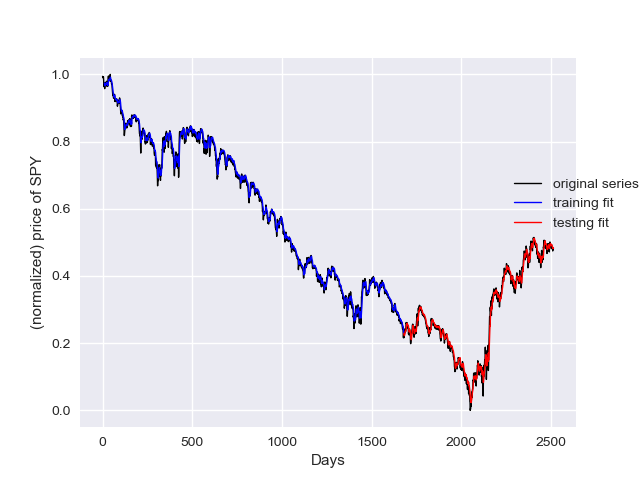
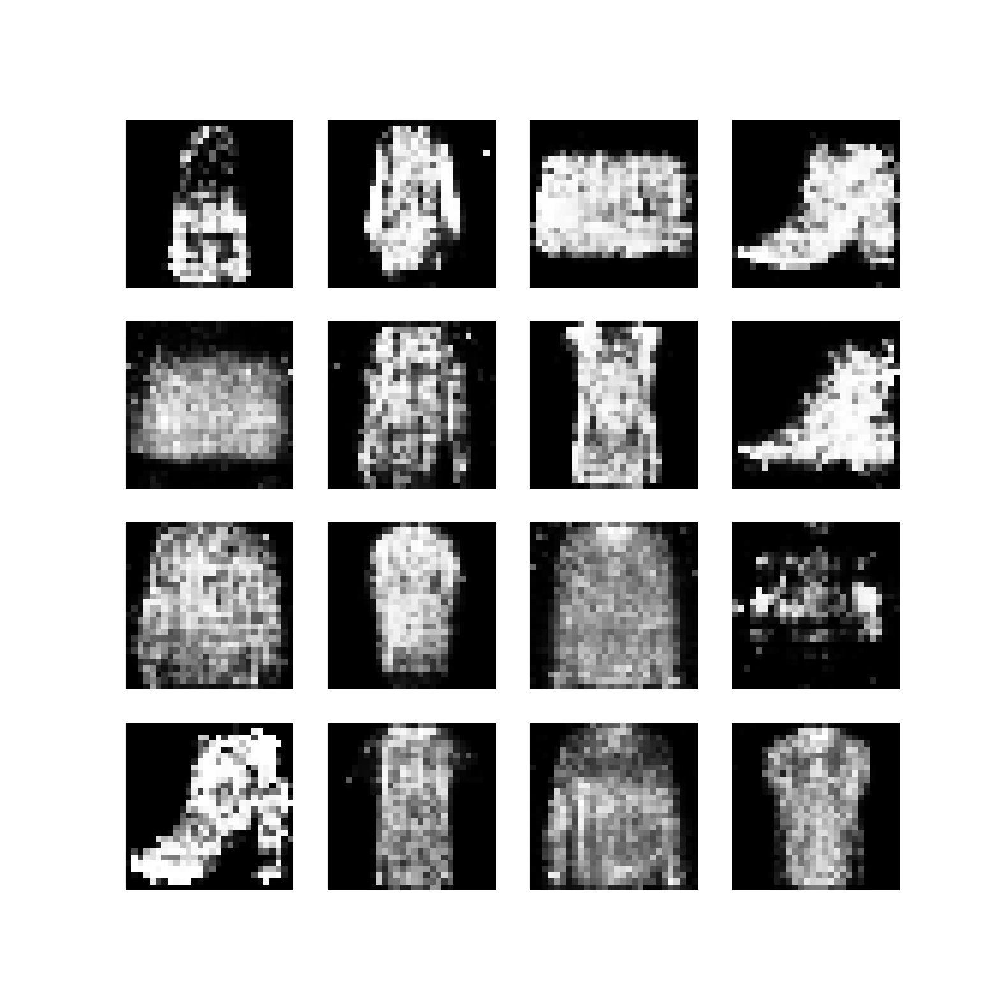
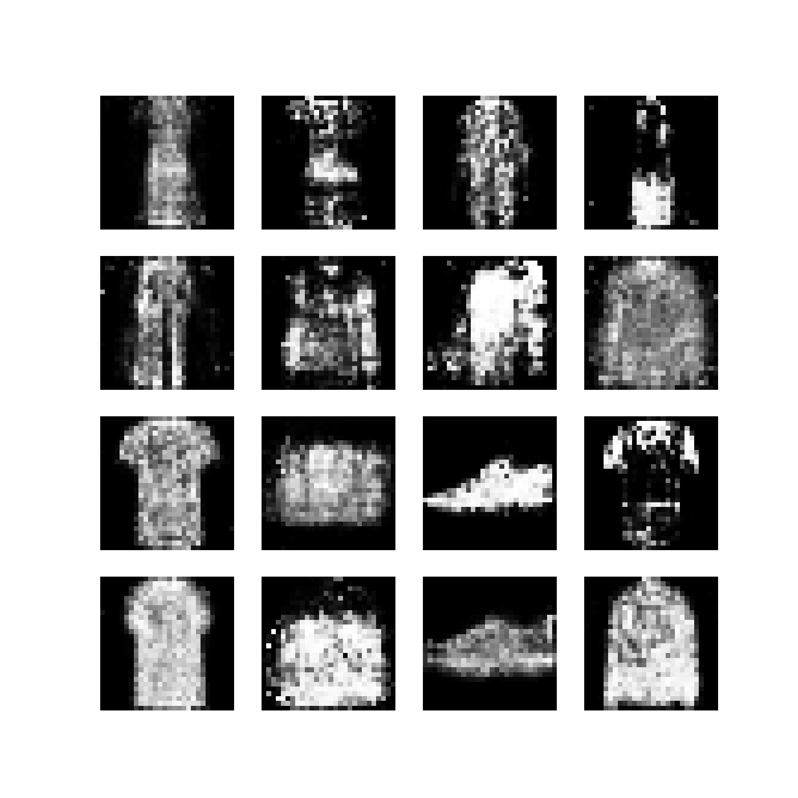
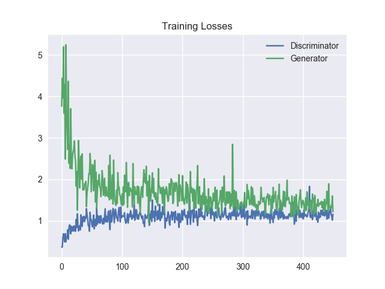

## Welcome to AI Lab! ##
+ This is a playground for testing AI techniques.

It is kept simple and uses components for reading and preprocessing data, 
validation, running algorithms and finally showing results in a generated HTML file.

The idea is to research ideas and explain roughly what does what. 

This way someone else can just re-run it and see the flow of using it and learning on the way.
There are no rules how to use it except that it should be reproducible by anyone with a few commands. 

For the labs, some data is included and some will be downloaded when run. 


To install prerequisites (after setting up python 3.6 and pip) type:

```
pip install requirements.txt
```

To Run type:

```
python AILab.py
```

And follow the menu choices


### Labs included for now ###

* **LSTM Lab** - Time series Prediction based on 2500 days on SPY: SPDR S&P 500
* **GAN Lab** - Using Generative Adversarial Networks - Generate Fashion Images based on the Fashion MNIST Database
* **Machine Translation Lab** Translate from English to French
* **Sentiment Analysis Lab** Write a positive or negative movie review - Base on IMDB review data
* More labs to come...


Also, there is a simplistic system info choice where you can, amongst other info, check if GPU is enabled in tensorflow.

A visual studio project file for windows is included, but the project should work in linux/MacOS as well if manually set up in your own favorite IDE.


/Aries

### Screenshots ###

**LSTM LAB**

- Training time in seconds:30.18
- Window size peek:10
- Training error:0.00013399767728792893
- Testing error:0.00018534520819164885
- Total days input:2515
- Days used for training:1670
- Days used for testing:835




**GAN LAB**





